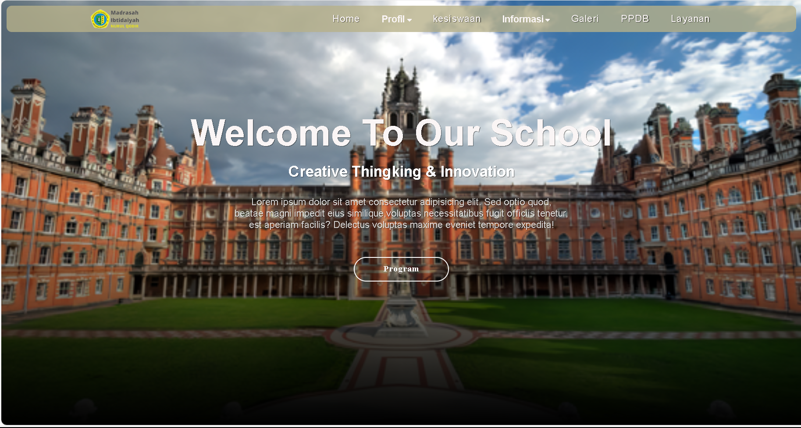

# Progres - News homepage

## Welcome! 👋

Thanks you for you, and help me for give start.
@Wadiddrrhmn_

## project
Sorry, here I just want to apply the results of some knowledge that I want to repeat, namely:
1. Responsive to all devices
2. Paralexe
3. Fill my free time to develop and remember.

As mentioned above, there are many ways to host your project for free. Our recommend hosts are:

- [GitHub Pages](https://github.com/Wadidurrahman)

**Have fun building!** 🚀